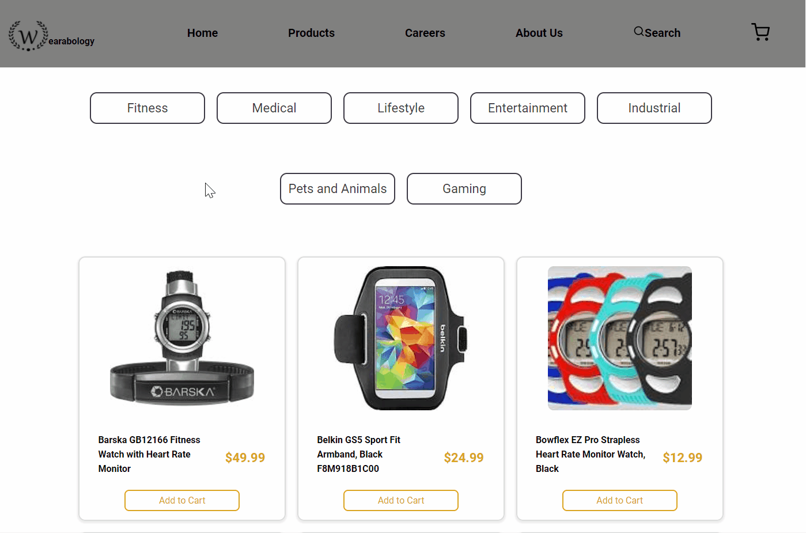
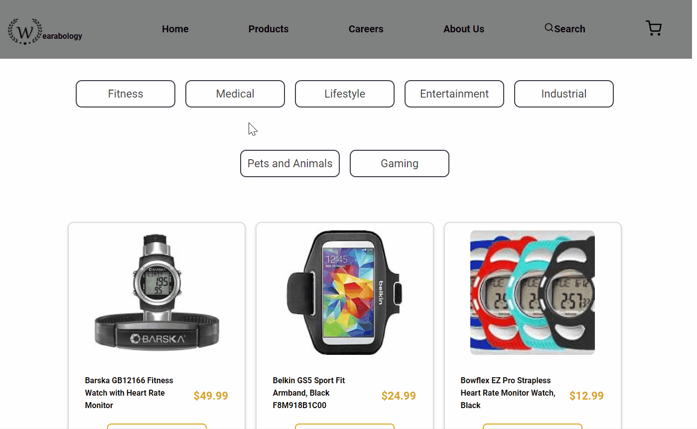

# Welcome to WEARABOLOGY!

This demo is meant to showcase our knowledge of
React with a node.js express server to create a web app storefront selling wearable tech.

---

## FEATURES

- RESTful backend API to fetch and update store items and cart items.

- React-redux enabled for front-end state-management that also does back-end verifications of cart items and prices upon checkout.

- Side drawer to render cart items, allows for quick checkout and easy cart management.

- Users are able to quickly browse items being fetched from the back-end and filter through various categories.

- Each item can be quickly added to the cart in any view, for any quantity (which gets updated in the navbar).

- About Us and Careers page to bring realism to the brand and to feature ourselves!

---

## Example

### Animated Landing Page

Also includes randomly featured products

\

---

### Quickly Add Items to Cart for Checkout

\

---

### Filter Items by Category

\

---
